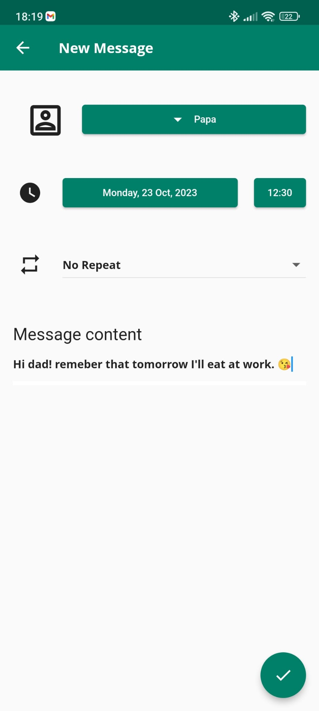
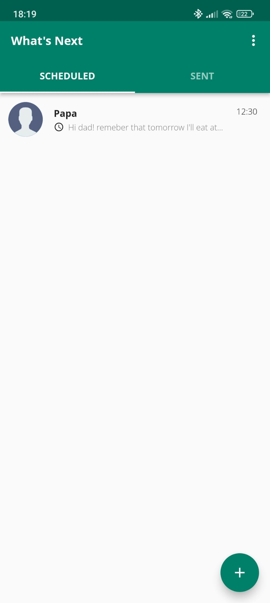
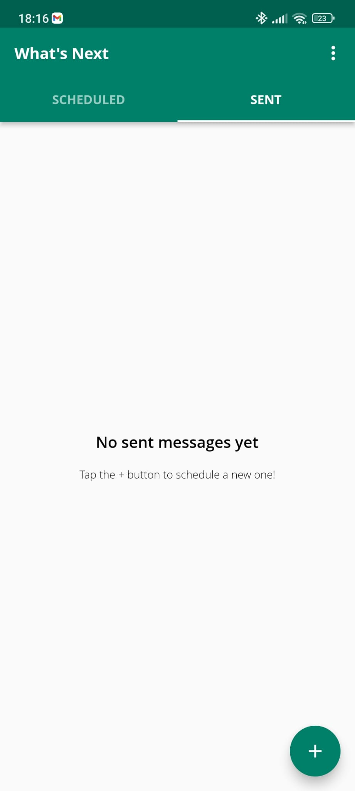

# What's Next 
Whats next is a simple Flutter app prototype designed to schedule the sending of WhatsApp messages. 

# What is working for the moment
At the moment the application has 3 screens that simulate the aesthetics of the original application:
- Scheduled messages screen
- Screen for scheduling a new message
- Screen with the history of sent messages

It is also able to recognise the contacts of the google account associated with the phone.

    
  
  

# Features
New functionalities will be added soon to this project: 
- Connection with the Whats App API for sending messages.
- Creation of the message sending routine
- Screen for editing scheduled messages 

